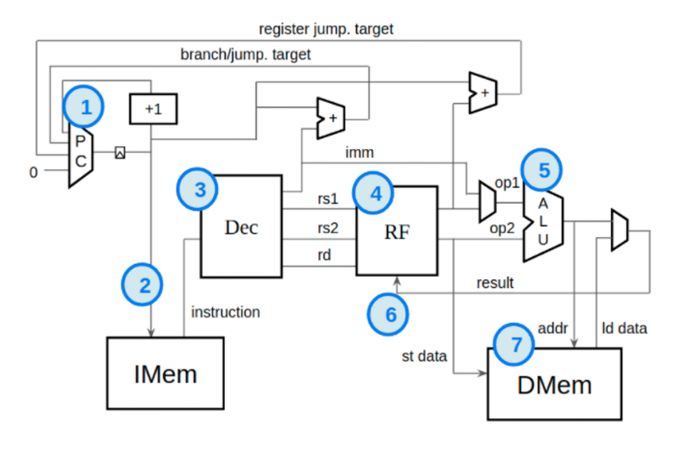

# Infiresv0.1-RV32IC-Core

## About

"Infires" is a RV32X Series processor cores, written in TL-Verilog. Due the unique features in  Transaction Level Verilog, these cores can easily be modified to support other extensions or enhanced with branch predictors, hazard handlers etc., Due to the timing abstract nature of TL-Verilog, the pipelines can be quickly reconfigured or parametrised too. There are four cores developed namely

## Variants

- ### [Infiresv0.1.0 - RISC-V RV32I Non-pipelined Core ]("https://github.com/shariethernet/Infiresv0.1-RV32IC-Core/tree/main/InfiresRV32I-non-pipelined")
- ### [Infiresv0.1.1 - RISC-V RVC (16-bit Compressed Instructions)]("https://github.com/shariethernet/Infiresv0.1-RV32IC-Core/tree/main/InfiresRVC")
- ### [Infiresv0.1.2 - RISC-V RV32I 4 stage pipelined Core ]("https://github.com/shariethernet/Infiresv0.1-RV32IC-Core/tree/main/InfiresRV32I-5stage-pipelined")
- ### [Infiresv0.1.3 - RISC-V RV32I 6 stage pipelined Core ]("https://github.com/shariethernet/Infiresv0.1-RV32IC-Core/tree/main/InfiresRV32I-5stage-pipelined")

## General Block Diagram of the core

1. Program Counter
1. Instruction Memory
1. Decode Logic
1. Register File
1. Arithmetic and Logic Unit
1. Write to Register File
2. Data Memory

## Pipeline Stages

### Infiresv0.1.2 - RISC-V RV32I 4 stage pipelined Core

1. Fetch
1. Decode
1. Register File Read
1. Execute in ALU, Register File Write, Branch

### Infiresv0.1.2 - RISC-V RV32I 6 stage pipelined Core and Infiresv0.1.1 - RISC-V RVC

1. Fetch
1. Decode
1. Register File Read
1. Execute in ALU, Register File Write, Branch, Load , Jump
1. Data Memory
1. Write to data memory

All the cores are written in TL-Verilog. These are relatively simple cores which can be used for learning a chip design flow from front-end to tape-out as well as applications that demand low-power and dosent require high performance. 

### References
- [RVMYTH Core]("https://www.vlsisystemdesign.com")

